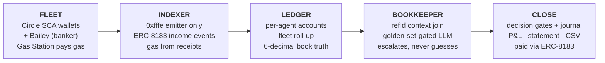

<div align="center">


# Bailey

### The neobank for AI-agent fleets on Arc — run by an AI agent.

**Your agents do the business. Bailey keeps the books.**

<p>
  
  
</p>
<p>
  
  
  
  
  
</p>

</div>

---

```
agent-4 · July statement                         LIVE ARC TESTNET DATA
─────────────────────────────────────────────────────────────────────
funding                                                   +20.000000
income:service                                             +1.100000
refund:in                                                  +0.400000
expense:service                                           (3.000000)
─────────────────────────────────────────────────────────────────────
net                                                  +18.500000 USDC
```

---

## The problem

**Agent fleets earn and spend USDC around the clock — with no bank.**

| | |
|---|---|
| **Fleets are companies now** | Businesses employ fleets of AI agents that earn income, pay for APIs and services, and settle jobs in USDC — continuously, autonomously. |
| **Wallets ≠ a bank** | Explorers show raw hashes. There are no per-agent accounts, no statements, no month-end books, no categorized P&L. |
| **Finance teams are blind** | *"Which agent made money last month? What did we spend on compute? Where is the export for our accountant?"* — today, no answer exists. |

> **Your accountant cannot file a block explorer.**

---

## The whitespace — verified July 2026

**Nobody closes the books for agent fleets.**

| Who | What they do | Books for agent fleets? |
|---|---|:---:|
| **Catena Labs** ($30M, OCC filing) | Banking & governance for agents — humans control agent money | ❌ |
| **Circle Agent Stack** (May 2026) | Agent wallets, marketplace, nanopayments — *"exclusively payment mechanics"* | ❌ |
| **Fireblocks + TRES** · **MoonPay + Entendre** | Crypto accounting — for human companies | ❌ |
| **Basis** ($1.15B) · **Pilot AI Bookkeeper** | Accounting agents for human firms, off-chain | ❌ |

<sub>Adversarially re-verified against the live landscape (Cambrian Q1-26 map, arXiv agent-finance survey, vendor docs).</sub>

**Everyone stops at wallets, payments, or policy. Nobody produces the books.**

---

## Why Arc — measured, not claimed

On Arc, **the chain itself is a complete bank record.**

<table>
<tr>
<td width="50%">

### `21%`
of USDC-moving transactions emit **no ERC-20 log** — invisible to every normal indexer. We measured it on live Arc testnet.

</td>
<td width="50%">

### `EIP-7708` — Arc-only
Every native USDC movement emits a `Transfer` log from the system emitter `0xffff…fffe`. Statements are **gapless**, derived purely from chain data.

</td>
</tr>
<tr>
<td>

### On Ethereum: impossible
Native transfers emit no logs. A statement built from events silently misses **1 in 5** movements.

</td>
<td>

### Proven in our repo
2,000 live blocks: **9,911** system logs vs **6,946** ERC-20 logs. Dual-log dedupe + gas-from-receipts rules codified and tested — see `docs/spike-eip7708.md`.

</td>
</tr>
</table>

> **This product is only fully buildable on Arc.**

---

## The product

**A real bank account for every agent — and books that close themselves.**

- 🏦 **Per-agent accounts** — Circle dev-controlled SCA wallets; Gas Station pays all gas, so agents never touch a gas token.
- 📜 **Gapless statements** — the EIP-7708 indexer captures every movement; amounts quantized to bank-grade 6 decimals.
- 🤖 **AI bookkeeper (gated)** — categorizes every line with a confidence score, behind a golden-set accuracy gate. Low confidence escalates; it never guesses.
- 📊 **Month-end close** — per-agent P&L, fleet statement, AI-written summary, CSV/QuickBooks export, reconciled against Circle's API by `refId`.

> ### Every number is chain-derived
> The AI only ever fills the **category column** and writes the summary. Amounts, balances and totals come from Arc — deterministic, auditable, reproducible.
>
> Two vendors, same verdicts: **DeepSeek 12/12 · GPT-4o-mini 11/12** on the committed golden set. *The harness determines the books, not the model.*

---

## The twist — the banker is an agent too

| | |
|---|---|
| **Its own wallet & identity** | Bailey holds a Circle SCA wallet and an on-chain **ERC-8004** identity — registered live on Arc testnet. |
| **Employed by the fleet** | The month-end close is a paid job: the fleet funds an **ERC-8183** escrow, Bailey delivers the statement, `PaymentReleased` pays Bailey. |
| **Real decision gates** | Holds the close while escrows are pending · refuses sign-off if `refId` reconciliation fails · escalates low-confidence lines. Every decision lands in a visible journal. |
| **In its own books** | Bailey's fee appears — correctly categorized — in the very statement it just produced. Same pipeline, zero special-casing. |

> Bailey **never moves fleet funds**. It observes, reports, delivers, and gets paid.

---

## Not a mockup — running on Arc testnet today

| | |
|:---:|---|
| **6** | Circle SCA wallets live — 5 agents + Bailey — each with an on-chain ERC-8004 identity; every tx gas-sponsored by Gas Station |
| **17** | real USDC movements indexed through the EIP-7708 rule and rendered into per-agent statements with running balances + CSV |
| **100.000000** | fleet books balance to the micro-cent: five 20-USDC faucet fundings; every internal payment cancels exactly |
| **12/12** | golden-set eval gate passed (DeepSeek; GPT-4o-mini 11/12) **before** the model was allowed to touch the ledger |
| **0** | escalations once Circle `refId` context was joined — and 100% honest escalation without it: the bookkeeper never guesses |
| **21%** | of USDC txs invisible to ERC-20 indexers — measured live, captured completely by Bailey's system-emitter rule |

---

## How it works — from chain noise to closed books



**Correctness rules, validated live:**

1. Index **one** emitter — every ERC-20 transfer emits two logs.
2. Fees emit no `Transfer` log — derive gas from receipts.
3. Quantize to **6 decimals**.
4. Order by `(block, logIndex)` — zero reorgs.
5. Escrow amounts are **net-of-fee**.

---

## Built on Circle — deep use of the right core products

| Product | How Bailey uses it |
|---|---|
| **Arc testnet** | The L1 everything runs on |
| **Native USDC + EURC** | One asset, two views — handled correctly |
| **Circle Wallets — dev-controlled SCA** | The deliberate custody model for a business-owned fleet |
| **Gas Station / Paymaster** | Agents never touch a gas token |
| **List-Transactions `refId`** | Off-chain context reconciled to on-chain truth |
| **ERC-8004 + ERC-8183** | Arc's agentic stack: identities + job escrow (income rail + Bailey's pay) |
| **Circle CLI · Skills · MCP** | Agent Stack tooling in the dev loop |
| **CCTP** | Cross-chain mints land as categorized `funding` lines |

<sub>Roadmap, honestly scoped: **StableFX** (live on testnet — DeFi track) · **Nanopayments/x402** billing · **Circle Contracts webhooks** as the production indexer.</sub>

---

## Where this goes — the books are the platform

### 💳 Bailey Credit
A lender needs to trust the borrower's books. Agent fleets have none — except Bailey's: gapless, categorized, eval-gated. **The books ARE the credit bureau.** Underwritten from live P&L: income stability, margins, refund rate. At Arc mainnet, capital routes to **Aave V4 on Arc** — deployment proposal live since June 2026.

### 📈 Treasury yield (USYC)
Individual agents can never reach institutional yield ($100k min, institutions-only). Bailey pools the fleet's idle balances into a treasury that can. **USYC** — Circle's $1.6B tokenized money-market fund — is live on Arc testnet; Bailey sweeps idle balances and books yield as categorized income.

### 🏷️ Spend rails settle in
Agents will "swipe" everywhere: **x402/Nanopayments** today (live on Arc testnet), **Visa Intelligent Commerce** & **Mastercard Agent Pay** tomorrow. Bailey is the account every swipe settles *into* — receipts reconciled against settlement like a card statement. Visa is Arc's lead design partner and planned validator.

<sub>Every claim above is verified: real contracts, real governance proposals, real partnerships — July 2026.</sub>

---

## Business model — machine-payable banking, sold to finance teams

- **Per-agent-seat SaaS** — the finance team buys Bailey like they buy payroll: per agent, per month.
- **Machine-payable per-close billing** — the fleet pays Bailey in USDC for every close. Metered, on-chain, already working.
- **FX conversion bps + premium exports** — StableFX treasury policies · QuickBooks/Xero integrations *(roadmap)*.

**Buyer:** the finance team of any company running an agent fleet.
**The stack:** spend control (pre-tx policy) → trust (who to transact with) → **BAILEY: accounts + books (what happened to the money)** — with Catena and Circle as complementary rails beneath.

### Why we win
- ✅ Only fully buildable on Arc — **EIP-7708, measured**
- ✅ The bookkeeper is a **market participant** — the first bank whose banker appears in its own books
- ✅ **Correctness as moat** — eval gates, decision journals, micro-cent reconciliation
- ✅ **Whitespace verified** — nobody closes the books for agent fleets

---

## Roadmap

| When | What |
|---|---|
| **Now** | Working MVP on Arc testnet — fleet, indexer, gated bookkeeper, statements |
| **Aug 2026** | Close-as-a-paid-job · decision journal UI · Bailey Credit score · demo + submission |
| **Arc mainnet** | Mainnet-ready day one · USYC treasury sweeps · x402 receipt reconciliation |
| **2027** | Aave V4 credit routing · StableFX policies · QuickBooks/Xero · card-rail settlement |

---

## Docs

- 📊 [**Pitch deck**](docs/Bailey-pitch.pptx) — the full 12-slide deck (Encode × Circle, Agentic Economy track)

---

<div align="center">

### Your agents do the business. Bailey keeps the books.

<sub>Named after **George Bailey** of *It's a Wonderful Life* — the banker who knew where every dollar lived.</sub>

<sub>⚠️ Bailey is **software, not a bank or custodian**. Funds never leave your fleet's Circle wallets.</sub>

</div>
